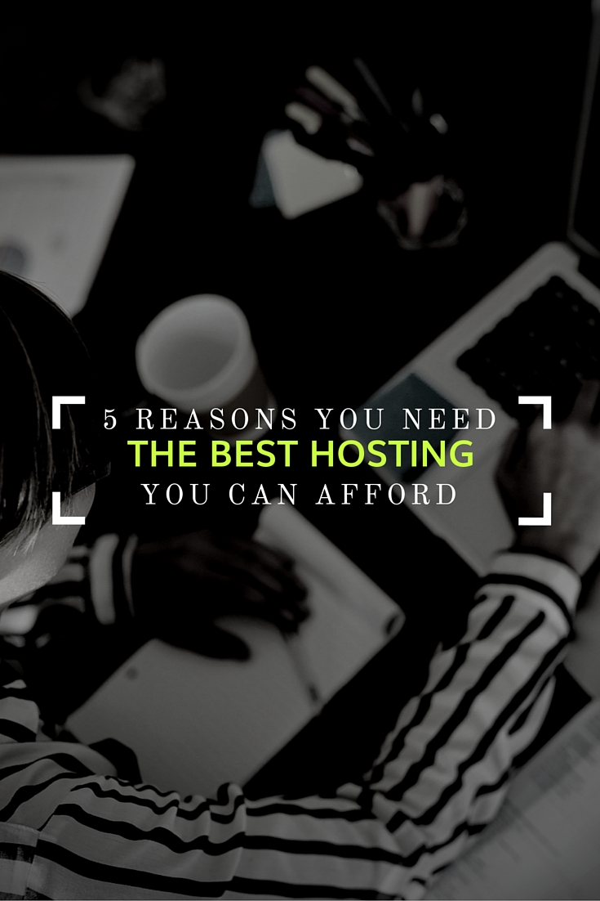

## 

## You Pay For What You Get

Ah web hosting, that necessary evil required to have a website. You’ve probably seen (or even have) the crazy cheap deals you can get on hosting (think $1 / month). All hosting is pretty much the same right? So why not save some bucks and go with the lowest priced option.

WRONG!

Your web host is where ALL of your website files live. Your web host is where hacks and other security concerns happen. Your web host can have a huge impact on the speed of your website. Your web host stands between you and your website.

Do you want the best option or the cheapest option in charge of your website? Do you care about speed and security? If something goes wrong, does your web host have a great support system in place?

You pay for what you get.

So if you are paying $1 / month for hosting, you are getting $1 / month service. Your website will be slow, you will be vulnerable to hacks (because you’ll be on a shared server with who knows who else) and you will be hard-pressed to find someone to help you if something goes wrong.

Here’s a look at 5 reasons why you need the best hosting you can afford.

## 1\. Speed

Shared hosting (those $1 plans you see from GoDaddy and Bluehost and the like) is slow. You are sharing resources to begin with and the meager resources you get are barely enough to run even the simplest sites. Sure, your site might load quickly if it’s largely text based. But a few images or videos and forget about it. You’ll be waiting an eternity for your website to load.

Loading speed is crucial to your website. Google uses page speed as a factor in your site’s rankings. Users expect pages to load in [3 seconds or less](https://econsultancy.com/blog/10936-site-speed-case-studies-tips-and-tools-for-improving-your-conversion-rate). The easiest and quickest way to increase your site speed is to upgrade your hosting.

That means if you’re using Wordpress, look for a Wordpress specific host (download my list of the top hosting companies here). If you’re not on Wordpress look for a VPS plan from a reputable hosting company.

## 2\. Security

Have you ever heard from a customer that your website is coming up in search listings with the “This site contains malware” flag? Not a fun experience. Hacks can be caused by a number of things like outdated plugins or themes, however, shared and low-budget hosting can be a leading cause.

Getting your site hacked into can be a hugely expensive problem. Not only do you have to pay someone to fix but your website may be out of commission for days or weeks while clean-up is happening, losing traffic by the second.

There are also further reaching implications of website hacks. Did you know the Panama Papers data exploit could have been caused by outdated Wordpress plugins? Or what about the recent trend of “ransomware”, where hackers are able to completely encrypt a system and demand payment before releasing the contents of the computer?

One of the first lines of defense against this is using a quality host that takes security seriously. You may not worry about this too much so let someone else do it for you because like it or not it’s something to worry about.

## 3\. Support

It’s inevitable -- something is going to go wrong with your website. It might go offline temporarily or some other problem crops up and you’ll need to contact your web host to solve.

Do you want to be waiting on hold for hours only to talk to someone who clearly has no clue? Or do you want your problem addressed quickly and efficiently by a team of experts?

Take the time to read reviews on some of the hosting companies you’re looking at. Pretty quickly you’ll be able to see how each stands up. I personally look for multiple ways to get in touch with support. Do they have a knowledgebase, phone number, live chat AND email address? They should.

## 4\. Flexibility

When you first start your website there’s a good chance you won’t have many pages or visitors. But what happens when you start growing and your visitor number increases? Or what happens if a blog post goes viral and you get an onslaught of hits?

It’s important to understand how your host handles this. Usually hosting companies offered tiered plans based on the number of pages and visitors your site has. The more pages and visitors the more expensive you’re plan will be. If you exceed your number will they cut-off your site or do you get a polite reminder to upgrade to the next plan?

You can start with the lowest option that meets your needs but be clear on what happens when you outgrow your current plan. You don’t want to find your website unavailable one day because you’ve gone over your visitor limit by a few people. Look for companies that will seamlessly move you from one plan to the next as your needs change.

## 5\. Platform

What platform is your website using? Maybe it’s Wordpress, maybe it’s Drupal or maybe it’s just standard HTML. Figure out what it is and then find a web host that specializes in that platform.

Would you get a handyman to build custom built-ins for you or would you hire a carpenter that specializes in custom carpentry?

Each different platform has it’s own unique setup. When a host is not optimized for a particular platform’s setup your website suffers.

There are so many options out there so go with an expert in your platform.

## Make the investment!

This is one area of your business that is crucial to invest in. Don’t let your website be slow and vulnerable just because you’re trying to save a few bucks each month.
