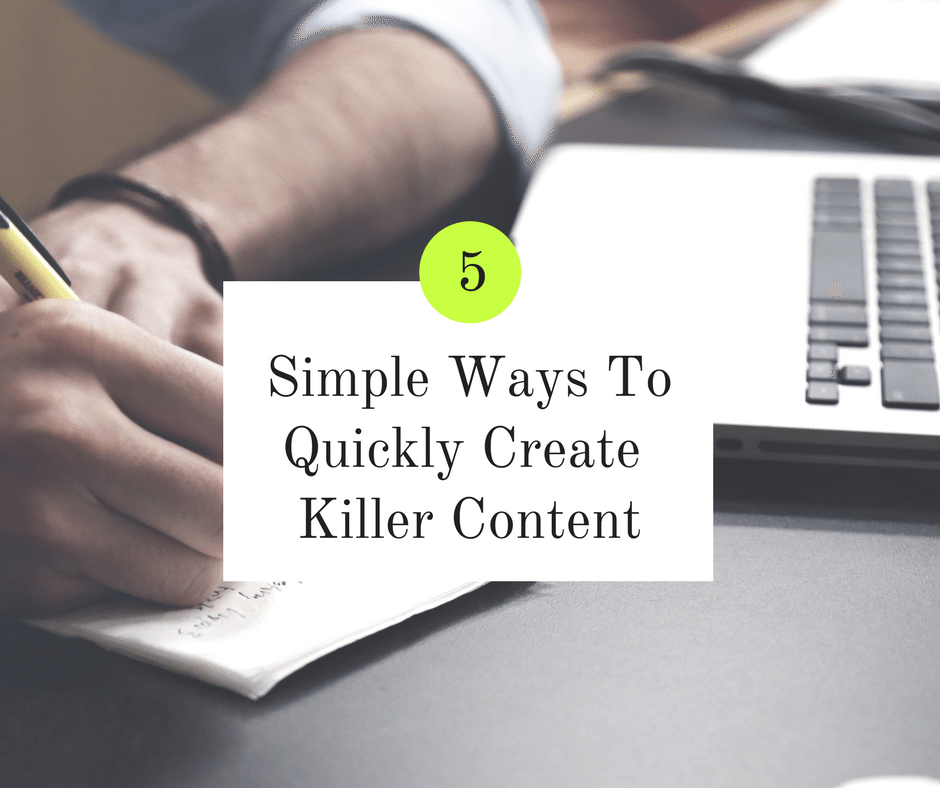

## 

## Learn 5 Easy Ways To Create Killer Content On A Consistent Basis

You’ve probably heard before that consistently creating great content on your website is a surefire way to move up in the search engine rankings. Easier said than done right?!

In this article, I’ll show you 5 simple ways to quickly create killer content for your website.

## The Problem: You Don’t Even Know Where To Start

Sound familiar? Trust me, I’ve been there. You’re staring at a blank document, ready to write a blog post you KNOW you should write.

But what do you even talk about? What should you have in the post? At this rate, you’ll be here for days!

## MYTH: Content Creation Takes Tons Of Time And Resources

It doesn’t have to be this way! Over the years I’ve narrowed down what makes a blog post great and how to quickly produce one.

Read on to learn the 5 ways...

## The 5 Ways

### Start With A Template

I start each of my posts with the same template.

It goes something like this:

#### **Headline**

The main headline of the post. This should be catchy and relevant to what you’re talking about. A good formula is: # ways you can \[have more benefits\] \[remove headache\].

I also run my headline through the [CoSchedule Headline Analyzer](https://coschedule.com/headline-analyzer), which gives you clues on how to strengthen your headline.

#### The Promise

What benefit is someone going to get from reading your post? Will they learn a new technique or save time? Tell them right off the bat what’s in it for them.

#### The Problem

What problem are you solving? What question are you answering?

#### Myth Busting Outline

Most likely, information already exists on whatever topic you’re writing about.

Tell the reader why everyone else is wrong and why this NEW information is better.

#### The Method Outline

The meat of your article!

Here’s where you lay out the three to seven key teaching points of your framework.

#### Do’s and Don’ts Outline

Here’s where you can point out the usual rookie mistakes and power tips for success.

#### Next Steps Outline

Here’s where you tell your reader what to do next. Your advice won’t do any good unless the reader takes action! Tell them clearly what steps they should take next to ensure success.

BONUS: Download this content template to jumpstart your next blog post!

\[gravityform id="7" title="false" description="false"\]

### Add Videos & Images

<iframe class="giphy-embed" src="//giphy.com/embed/26tn33aiTi1jkl6H6" width="480" height="269.76" frameborder="0" align="center" allowfullscreen="allowfullscreen"></iframe>

 Images and videos are a key piece to creating killer content.

People learn in different ways. Some learn better by reading while others learn better by seeing. It’s important to provide your audience with a rich post that allows them to hear your message in a way that works best for them.

No one wants to look at long, unbroken blocks of text so make sure you’re adding pictures and/or videos to whatever you’re talking about. But make sure you’re picking the right ones! Find images & videos that are relevant to what you’re discussing and enhance the written word.

Here are some places to source images and video:

- [Pexels](https://www.pexels.com/) (free)
- [Unsplash](https://unsplash.com/) (free)
- [Giphy](https://giphy.com/) (free)
- [Pikwizard](https://pikwizard.com/) (free)
- [iStockPhoto](http://www.istockphoto.com/) (paid)
- [Shutterstock](https://www.shutterstock.com/) (paid)
- [Twenty20](https://www.twenty20.com/) (paid)

### Use A Process

<iframe class="giphy-embed" src="//giphy.com/embed/3o6MbhbYBsqTrbP2qQ" width="480" height="362" frameborder="0" align="center" allowfullscreen="allowfullscreen"></iframe>

Here at SaraChandlee.com we use A LOT of processes.

A process is essentially a list of steps to take to complete a task. We’ve found this cuts down on errors, questions, and overall time spent on tasks.

You can create a simple Google Doc to keep your processes or more advanced software like [Process.st](https://www.process.st/) (this is what we use).

Here’s a quick outline of what our process looks like for writing & implementing a blog post:

- Decide on post topic
- Duplicate Content Creation template into client G Drive folder
- Write post outline (starting with content template)
- Expand outline into full content
- Proofread text-only post for spelling/grammatical errors
- Source images & videos to compliment post
- Source featured image
- Create featured image & social images in Canva
- Add post to Wordpress
- Set SEO information
- Publish

Every time we go to publish a new blog post, we start with this checklist. It makes the process seamless and consistent for each post we put out.

### Use Catchy Headlines

The truth is that most people don’t read on the web - they scan.

This means your text should be broken by short, catchy headlines to clue the reader into what each section is about.

People will read the headlines first and then decide to read the rest.

Use the CoSchedule Headline Analyzer if you’re having trouble coming up with headline ideas. And remember - these don’t have to be the best headlines known to man.

If it’s clear to the reader what that section is about, they’re good enough.

### Write Short, Scannable Sentences

Again, people won’t read your huge block of text!

No matter how insightful, original, hilarious, or otherwise amazing your content is, if it’s long paragraphs of text no one will read it.

Break that sucker up!

One or two sentences per paragraph are perfect. This allows your reader to quickly scan through the text and read more deeply if something catches their eye.

Nothing is going to catch their eye if it’s buried deep in a block of text!

## The Do’s and Don’ts

Here are a few more tips on what to do and what to avoid:

- Don’t just write for the sake of writing.
- Don’t try to pay someone $5 for a 1000 word article and expect it to be of any quality.
- Don’t try to combine pieces of other articles into a single article that’s barely readable.
- Don’t forget about your audience - the content should speak to them.

- Do write original, thoughtful content.
- Do use fonts and colors that are legible and easy on the eyes.
- Do pay attention to image size - they should be smaller than 1 MB. [Click here for](https://om4.com.au/client/preparing-image-files-before-uploading-with-wordpress/) more information on image sizes.
- Do include a clear call to action at the end of your article.

## Homework

<iframe class="giphy-embed" src="//giphy.com/embed/3otPoS81loriI9sO8o" width="480" height="270" frameborder="0" align="center" allowfullscreen="allowfullscreen"></iframe>

You made it to the end, yay!

Your homework is to write a blog post for your site. Download the content template and follow the process I laid out above (or use your own) to get your post written and implemented in record time.

\[gravityform id="7" title="false" description="false"\]
