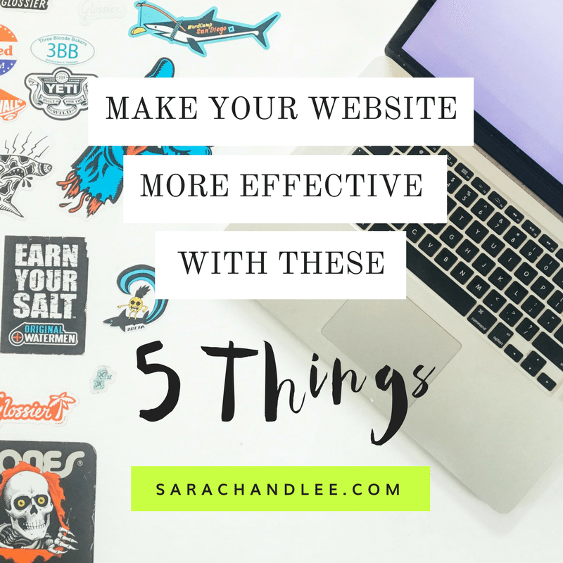

After reading this article, you’ll have 5 things you can add to your website to make it more effective, bringing in more customers and sales.

Some of these things are easier than others, and some may require help from your developer. But I promise, if you make sure your site has these 5 things, you WILL see an increase in the effectiveness of your website.

## Your website should be a lean, mean, selling machine.

Meaning, your website should be bringing in new customers on the regular, whether that be through direct sales of products on the site, contact form submissions or e-book downloads.

And if it’s not, time to make some changes.

## It’s not as simple as a new “design”.

Often times when businesses decide to redo their websites (or build from scratch), they focus on the design of the site. Many web designers fall into this trap as well - they start a project by sourcing templates or focusing on the design first, rather than planning other pieces of the site.

Yes, the design of the website is an important factor. And when I say design, I mean the way the site looks, the colors and fonts used and the general aesthetic of the site.

But there are so many other things that go into making your website the effective marketing tool that it should be.

## The 5 things every effective website should have.

### Clear, concise messaging

<iframe src="https://giphy.com/embed/l2JdTkHW1KZPdvdS0" width="480" height="362" frameborder="0" allowfullscreen="allowfullscreen"></iframe>

[via GIPHY](https://giphy.com/gifs/season-15-the-simpsons-15x5-l2JdTkHW1KZPdvdS0)

People are busier than ever and are exposed to thousands of marketing messages per day. You have about 3 - 5 seconds to connect with someone before they’re gone.

That’s not much time so it’s crucial that your message is short and to the point.

When someone visits your site, they should be able to understand what you offer, how it will make their life better and how they can buy it. All in under 5 seconds!

Abe Simpson does a great job with his website - "Why today stinks". Pretty clear on what he's talking about!

#### My personal experience

I recently made this change to my own website. Here’s what my tagline used to say:

**Your business is unique. Your brand should be too.**

This makes it sound like I’m maybe a brand designer and while branding is part of what I do, it’s nowhere near the full picture. But wait! I was telling them what else I did! Here’s the text I had under my tagline:

_I help businesses stand out online (and in the real world) by crafting unique, memorable websites, logos, and business collateral and providing long-term hosting, maintenance, and marketing services._

_Let me help you grow and excel in your business. Click below to schedule your free 15-minute discovery session to see if we're a good fit._

That’s a lot of text that honestly, no one was reading. Sure, it gave people a much better idea of what I offer but still. You probably didn’t even read it.

I would get maybe 1 contact request from my website every 2 months or so. Not great.

A few months ago, I made some changes and here’s what my homepage says now:

**We help small businesses and entrepreneurs succeed online.**

_Web Design & Development | Website Care Plans | Branding | SEO & Marketing_

After making that change, I now see 2 - 3 leads coming in per month. Not a bad increase in conversion rates!

### Clear call-to-action

This is the “how do I get it” piece of your message. There needs to be ONE obvious action a user should take and it should be consistent throughout the site.

Do you want someone to contact you to set up an appointment? Buy something from your shop? Download your PDF?

Decide right now what your main call to action is and make it obvious on your website.

This means there needs to be one big, prominent button that tells someone to do that thing. On my site, it’s the “[Let’s Talk](https://www.sarachandlee.com)” button.

I want someone to fill out my project worksheet form and then schedule a call with me.

But notice my CTA (call-to-action) isn’t “Fill out my worksheet and then schedule a call”. Too much information!

I’ll guide them through that process as soon as they click the button, but to start, I just let them know that I want to talk to them.

Your CTA button needs to be the most obvious thing on the page. That means if your CTA button is orange, the button that says “Learn More About Us”  needs to be gray or another less obvious color.

### Testimonials

<iframe src="https://giphy.com/embed/vCKC987OpQAco" width="383" height="480" frameborder="0" allowfullscreen="allowfullscreen"></iframe>

[via GIPHY](https://giphy.com/gifs/funny-celebrity-bill-murray-vCKC987OpQAco)

Someone visiting your site wants to know how your product or service can benefit them.

One of the best ways to tell this story is through customer testimonials or reviews.

There’s nothing like having someone else describe the success they’ve seen by working with you. It’s a powerful message that will resonate with your audience.

I like to pepper testimonials and reviews throughout my sites instead of having a single page that lists them all. Remember, people will only give you a few seconds of their time and are unlikely to read through a page of testimonials.

Try to get permission to use your customer’s picture alongside their words for maximum impact.

### Mobile-Friendly Site

This is no longer a nice-to-have. Google will penalize your search rankings if your website isn’t mobile friendly.

Beyond a drop in search rankings, you’re providing your users with a poor experience.

We’ve all been on sites that you have to pinch and swipe to even get to the content and most people will just leave before doing all that. Don’t be that guy!

You can use [Google’s Mobile-Friendly Test](https://search.google.com/search-console/mobile-friendly) to check your site.

If you don’t pass the test, it’s time for a redesign plain and simple.

Use these tips as a guide while planning your new site and not only will you come out with a mobile-friendly site, you’ll have one that does the selling for you.

And hey, l[et’s talk](https://www.sarachandlee.com/schedule-discovery-session/) if you want to learn more about how I can help you!

### Compelling imagery

Our last must-have is compelling imagery. The old saying is true, a picture really is worth a thousand words.

Take a look at the images on your site and ask yourself:

Am I visually showing the success my customer will experience if they use our product?

The images on your site should show happy people experiencing the “after” when they’ve finished using your product.

Try to make your end-customer the hero of the story, not yourself and your business. What problem are they experiencing right now and what does their life look like after you’ve fixed the problem?

The images on your site should show that happy “after” state, with the problem solved all thanks to you.

It’s always best to use unique, personal images of your actual customers but a lot of times that’s not possible.

You can source some great stock photos from sites like [Pexels](https://www.pexels.com/) (free), [Unsplash](https://unsplash.com/) (free), [Twenty20](https://www.twenty20.com/) (paid) or [iStockPhoto](http://www.istockphoto.com/) (paid).

And steer clear of the cheesy stock photos, please! 

<iframe src="https://giphy.com/embed/h9MW1jrFfw6k0" width="480" height="320" frameborder="0" allowfullscreen="allowfullscreen"></iframe>

[via GIPHY](https://giphy.com/gifs/stock-photo-h9MW1jrFfw6k0)

## Just say no!

Here are a few things to just say no to:

### Sliders

Take a look at any [popular WordPress theme](http://maison.edge-themes.com/main-home/) these days and you’ll be greeted by a big home page slider.

Here’s some truth: no one’s reading anything past slide 1. In fact, [they may be ignoring the section altogether](https://www.nngroup.com/articles/auto-forwarding/), treating it the same as a flashing banner ad.

If you need 3 or 4 slides to present your message, it’s unclear and you’re going to lose customers.

Replace the slider with an impactful image or video showing your customer’s success. Have one tagline with one call-to-action. Don’t make them think!

### Flash

News flash, [Flash is dead](https://www.webdesignerdepot.com/2016/05/flash-is-dead-in-chrome-and-we-really-mean-it-this-time/)! Another clear sign its time for a redesign is if you have any Flash elements on your site.

From [Wikipedia](https://en.wikipedia.org/wiki/Adobe_Flash):

“Adobe Flash (formerly called Shockwave Flash, often just called Flash) is a [multimedia](https://en.wikipedia.org/wiki/Multimedia) [software platform](https://en.wikipedia.org/wiki/Computing_platform) used for production of [animations](https://en.wikipedia.org/wiki/Flash_animations), [rich Internet applications](https://en.wikipedia.org/wiki/Rich_Internet_application), [desktop applications](https://en.wikipedia.org/wiki/Application_software), [mobile applications](https://en.wikipedia.org/wiki/Mobile_application) and [mobile games](https://en.wikipedia.org/wiki/Mobile_game).”

Search engines won’t read the content, browsers and operating systems don’t support it and users don’t want it.

### Small fonts

People like to read things on the web and small fonts make that hard to do.

I’ve found that a lot of graphic designers love to put small fonts into websites. Small fonts look great in print but are hard to read on the web.

Remember, you want to make things easy for the end user, your customer. Make the font on your website large enough to read on screens of all sizes.

## Next Steps

Here are your next steps:

1. Review your website to check what elements you have and what elements are missing. [Download our handy checklist](https://www.sarachandlee.com/wp-content/uploads/2017/05/Website-Checklist.pdf) to simplify the process.
2. Make an action plan. What things can you fix yourself and what things do you need help with?
3. Get started. Put that plan into action! Make the changes you can make ASAP and get your designer or developer onboard if you need help with some things. If you’ve decided a redesign is in order, get the process started.

Have you put any of these ideas into action? Let me know what worked for you and what didn’t!
